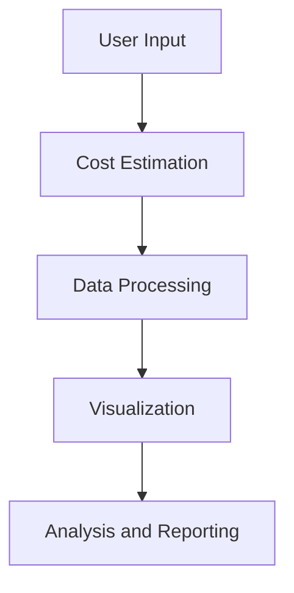

# FirstGens Cost Simulator

## Purpose
The FirstGens Cost Simulator is a tool designed to help users estimate and analyze the costs associated with various scenarios. It provides a visual representation of cost data and allows users to make informed decisions based on the simulated results.

## Features
- Cost estimation for different scenarios
- Visual representation of cost data using charts
- Customizable parameters for simulations
- Detailed analysis and reporting

## Installation

### Prerequisites
- Node.js (version 18 or higher)
- npm (Node Package Manager)

### Steps
1. Clone the repository:
   ```bash
   git clone https://github.com/andiekobbietks/firstgens-cost-simulator.git
   ```
2. Navigate to the project directory:
   ```bash
   cd firstgens-cost-simulator
   ```
3. Install the dependencies:
   ```bash
   npm install
   ```

## Usage

### Running the Simulator
1. Start the development server:
   ```bash
   npm run dev
   ```
2. Open your browser and navigate to `http://localhost:3000` to access the simulator.

### Example
To simulate a cost scenario, follow these steps:
1. Enter the required parameters in the input fields.
2. Click the "Simulate" button.
3. View the results in the charts and analysis section.

## Workflow and Architecture



## Troubleshooting and FAQ

### Common Issues
- **Issue:** The simulator is not starting.
  - **Solution:** Ensure that all dependencies are installed correctly by running `npm install`.

- **Issue:** The charts are not displaying correctly.
  - **Solution:** Check the browser console for any errors and ensure that the input parameters are valid.

### FAQs
- **Q:** Can I customize the parameters for the simulations?
  - **A:** Yes, the simulator allows you to customize various parameters to fit your specific needs.

- **Q:** How can I contribute to the project?
  - **A:** You can contribute by submitting pull requests or reporting issues on the GitHub repository.
